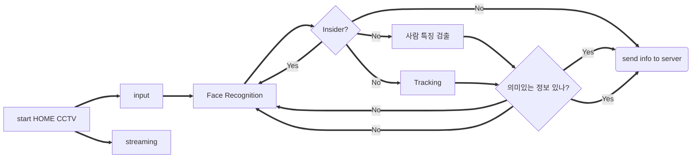
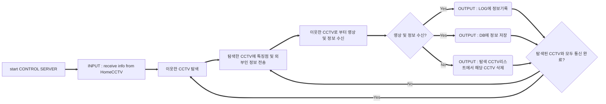
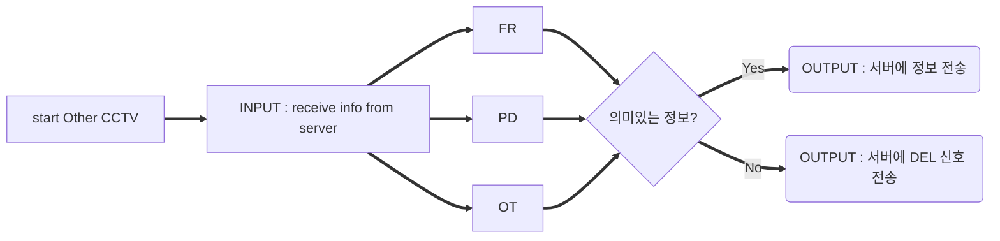

## tripleC system 구상도 

#### Home CCTV

```mermaid
graph LR
START[start HOME CCTV]==>INPUT[input]
START==>STREAMING[streaming]
INPUT==>FR[Face Recognition]
FR==>FRCOND{Insider?}
FRCOND==>|Yes| FR
FRCOND==>|No| PD[사람 특징 검출]
FRCOND==>|No| OT[Tracking]
FRCOND==>|No| SEND(send info to server)
PD==>IFCOND{의미있는 정보 있나?}
IFCOND==>|Yes| SEND
IFCOND==>|No| FR
OT==>IFCOND{의미있는 정보 있나?}
IFCOND==>|Yes| SEND
IFCOND==>|No| FR

```

#### CENTRAL CONTROL SERVER

```mermaid
graph LR
START[start CONTROL SERVER]==>INPUT[INPUT : receive info from HomeCCTV]
INPUT==>DP[이웃한 CCTV 탐색]
DP==>SEND[탐색한 CCTV에 특징점 및 외부인 정보 전송]
SEND==>RCV[이웃한 CCTV로 부터 영상 및 정보 수신]
RCV==>RCV_COND{영상 및 정보 수신?}
RCV_COND==>|Yes| LOG(OUTPUT : LOG에 정보기록)
RCV_COND==>|Yes| DB(OUTPUT : DB에 정보 저장)
RCV_COND==>|No| DEL(OUTPUT : 탐색 CCTV리스트에서 해당 CCTV 삭제)
DEL==>SEARCH{탐색된 CCTV와 모두 통신 완료?}
SEARCH==>|Yes| DP
SEARCH==>|No| SEND
DB==>SEARCH
LOG==>SEARCH

```

#### Other CCTV

```mermaid
graph LR
START[start Other CCTV]==>INPUT[INPUT : receive info from server]
INPUT==>FR
INPUT==>PD
INPUT==>OT
FR==>COND{의미있는 정보?}
PD==>COND
OT==>COND
COND==>|Yes| SENDINFO(OUTPUT : 서버에 정보 전송)
COND==>|No| SENDDEL(OUTPUT : 서버에 DEL 신호 전송)
```

